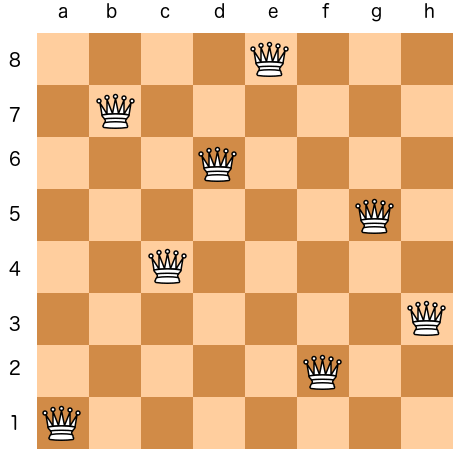
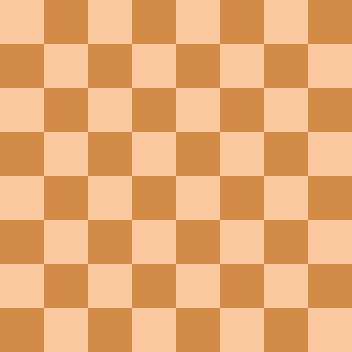

#  Solving the N queens problem using backtracking

## Author

Name : Khaled Osama Abdelhamid

Email : s-khaled.usama@zewailcirty.edu.eg


## Problem statement


The N queens problem is a very important ,and is the main example given when trying to introduce back tracking. The problem goes as follows. You have  N x N chess board and you have N queens , you have to put the N queens over the board without any one of them threating the others. To imagine the number of different combinations for an 8 X 8 board , the number of combinations are 64C8 , which is equivalent to 4,426,165,368 different states. Hence, finding the solution of the problem suing brute force will not be very efficient ,especially for large numbers of N .



<center><em>A solution to an <mmath>8 <mi>x</mi> 8 </math> case (pulled from wikipedia) </em></center> 


## Backtracking

<div style="text-align: justify"> 	The backtracking algorithm is a version of recursion that is famous among maze problems. The basic idea is that it tries to explore the solution pool by taking decisions and once it find a dead end, it tracks back to the precious decision to try another solution. the whole process ends one it reaches the goal of the problem. The main advantage over the brute force algorithm is that it tries to narrow down the possible solution by adjusting one simple decision at a time, unlike brute-force which may possibly change it altogether. </div>


<center><em>A simple example for back tracking , the we return back from the wrong answer(red) till we reach the correct one (green) </em></center> 


## Algorithm 

The algorithm consists of 2 main components:

1. The decision making function  this is the function that will be called when we want to choose to make a specific action over another one.

2. The validation function: this function checks if we have reached a non-solvable state or not.

   

The steps of the solution are as follows :

1. Call the action function to place the first queen.

2. Check first if this place is valid by checking for the following:

   - No queen can be in the same row with another queen.
   - No queen can be in the same column with another queen.
   - No queen should be in the same diagonal as the other queen.

3. If the move is valid then place the queen and do the following.

   - Call the placing function for the next queen and check if it finds a solution

   - If it found a solution then we recursively follow the same steps again.
   - if it didn't then we return a false value to the current place queen function indicating that this path is a dead end.

4. This will automatically remove the last step and start to find another solution for the previous queen because it now knows that if we went recursively through that path we would not reach a solution.

5. Keep exploring until you place all the queens and return true for the function ending the calling stack.

   


## How to run it

Open the terminal inside the current directory and hit 

```bash
python3 main.py
```

Or you can simply open the `main.py` file and simply run it with your preferred python IDE

## Solution cases

Here are the interesting observations in the solutions. Note that the queens are denoted by `1` and empty board is denoted by `0`

### Naive solutions

#### N = 0

simply the solution will be an empty array ` []` and that is a single unique solution, as the only solution for not board nor queen situation is just not placing anything at all 

#### N = 1

Almost similar to the previous case. having a board with the size 1 X 1 and one queen would give us a single solution, which is putting the queen in the empty spot `[1]`

### Impossible cases

#### N = 2 and N = 3

These cases are impossible to handle because once we put one queen , no other empty square will be protected from its threat.

### Multi-solution cases

#### N >= 4

All cases above grantees to have multiple solutions. The abundance of the solution comes from two sources. either by having fundamentally different solutions or a reflection or rotation variation from the main solution. Hence , we can deduce that for each solution we have at most 8 different sub-solutions (four for rotations and 2 for reflection).However some solutions have less than 8 sub-solutions, which comes from the fact that the solution has an axis of symmetry over the board which reduces the number of solution by half or also the rotation action outputs a similar configuration which reduces the sub-solutions more.

## References 

Here are some wonderful references that helped me understand the problem and learn how to implement it.

- [Codes Dope : Backtracking | N-Queens Problem](https://www.codesdope.com/course/algorithms-backtracking/)
- [Codes Dope : Backtracking - Explanation and N queens problem](https://www.codesdope.com/blog/article/backtracking-explanation-and-n-queens-problem/)
- [Medium Backtracking and 4 Queens problem](https://medium.com/@shreytandel09/backtracking-and-4-queens-problem-8fcfd62ace83)
- [N Queen Problem](https://www.tutorialspoint.com/N-Queen-Problem)


